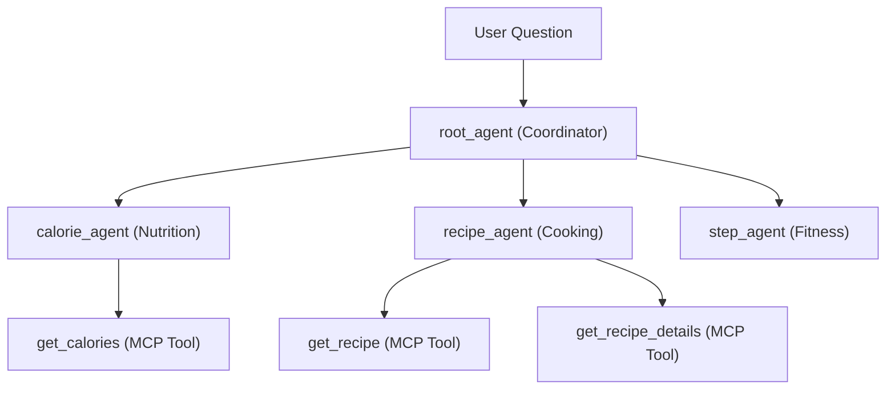

# Health Agent

An AI-powered health coach built with **Google Agent Development Kit (ADK)** and **Gemini 2.5 Flash**. A root coordinator agent intelligently routes food, recipe and health related questions to specialist agents—each with its own expertise in nutrition, recipes, or physical activity.

---

## Architecture


The **root agent** analyses each query and delegates to the appropriate specialist using ADK's native `sub_agents` mechanism. It is explicitly instructed to prioritize recipe suggestions when a user mentions a single ingredient without asking for calories.

---

## Tech Stack
| Layer | Technology |
|---|---|
| Agent framework | [Google ADK](https://google.github.io/adk-docs/) |
| LLM | Gemini 2.5 Flash |
| Language | Python 3.12+ |
| Local dev UI | ADK Web (`adk web`) |
| Deployment | Google Cloud Run |
| Tools | MCP (Model Context Protocol) |

---

## Agents
| Agent | Role | Tools |
|---|---|---|
| `calorie_agent` | Nutrition & food energy expert | `get_calories` |
| `recipe_agent` | Cooking & meal idea assistant | `get_recipe`, `get_recipe_details` |
| `step_agent` | Fitness & activity tracker | — |

---

## Setup
### Prerequisites
- Python 3.12+
- [uv](https://docs.astral.sh/uv/) installed
- A Google API key from [Google AI Studio](https://aistudio.google.com/)

### Installation
```bash
# Clone the repo
git clone https://github.com/hennasingh/Health-Agent.git
cd Health-Agent

# Create .env file
echo "GOOGLE_API_KEY=your_api_key_here" > .env

# Install dependencies (using uv)
uv sync

# Start the ADK web UI
uv run adk web health_food_agent
```

---

## Example prompts to try
- *"I have a potato, what should I make?"* → routes to recipe_agent
- *"How many calories are in a medium avocado?"* → routes to calorie_agent
- *"Give me a recipe for chicken salad"* → routes to recipe_agent
- *"How many steps should I walk for a 30-minute workout?"* → routes to step_agent

---

## Key Concepts
**Multi-agent routing** — Uses ADK's `transfer_to_agent` via the `sub_agents` parameter. The orchestrator collects data from specialists and aggregates it into a friendly response.

**Tool use** — Specialists use **MCP tools** to fetch real-time data, ensuring the agent doesn't hallucinate nutritional values or recipe steps.

**Model Context Protocol (MCP)** — A standardized protocol that allows AI agents to safely connect to external data sources. In this project, it connects the specialists to a custom Python-based health server (`mcp_health_server.py`) that provides live nutritional and recipe information.

---

## Deploying to Cloud Run
1. **Authenticate and set project:**
   ```bash
   gcloud auth login
   gcloud config set project multi-agents-aidevcamp2026
   ```
2. **Deploy:**
   ```bash
   uv run adk deploy cloud_run \
     --project=multi-agents-aidevcamp2026 \
     --region=europe-west1 \
     --service_name=health-agent-service \
     --with_ui \
     health_food_agent
   ```
